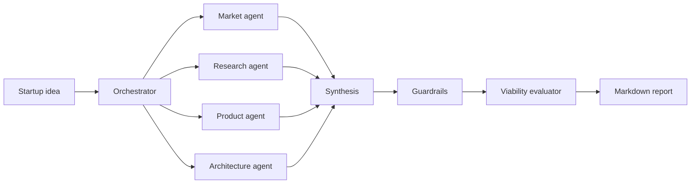

# MedTech Venture Lab

Turn a healthcare or MedTech startup idea into a structured company analysis using a multi-agent AI workflow built with LangGraph and Google Gemini.

The system evaluates an idea across market opportunity, clinical research, product design, and technical architecture. It then combines the findings, checks them for healthcare-specific risks, assigns a viability score, and generates a Markdown report.

## What it does

- Runs four specialist agents for market, research, product, and architecture analysis
- Synthesizes the agents' structured findings into one startup brief
- Checks for regulatory, clinical-claim, privacy, security, and HIPAA risks
- Scores startup viability from 0 to 100
- Produces a readable Markdown report and optional raw JSON output
- Supports sequential execution for low API quotas and parallel execution for paid quotas

## Workflow



## Requirements

- Python 3.10 or newer
- A Google Gemini API key

## Installation

```bash
git clone https://github.com/dabhishek9035-ui/medtech-venture-lab-with-multi-agents-.git
cd medtech-venture-lab-with-multi-agents-

python -m venv .venv
```

Activate the virtual environment:

```bash
# Windows PowerShell
.venv\Scripts\Activate.ps1

# macOS or Linux
source .venv/bin/activate
```

Install the dependencies:

```bash
pip install -r requirements.txt
```

Copy the provided environment template:

```bash
# Windows PowerShell
Copy-Item .env.example .env

# macOS or Linux
cp .env.example .env
```

Then add your Gemini API key to `.env`:

```env
GOOGLE_API_KEY=your_gemini_api_key

# Optional settings
GEMINI_MODEL=gemini-2.0-flash
AGENT_TEMPERATURE=0.3
PARALLEL_AGENTS=false
AGENT_DELAY_SECONDS=35
```

Keep `.env` out of version control because it contains your API key.

## Usage

Analyze an idea directly from the command line:

```bash
python main.py --idea "An AI system for early diabetic retinopathy detection"
```

Or start the interactive prompt:

```bash
python main.py
```

Choose a domain and output path:

```bash
python main.py \
  --idea "A remote cardiac rehabilitation platform" \
  --domain "Digital Health" \
  --output "output/cardiac-rehab.md"
```

Write the final graph state as JSON alongside the Markdown report:

```bash
python main.py --idea "A clinical trial matching assistant" --json
```

### CLI options

| Option | Description | Default |
| --- | --- | --- |
| `--idea` | Startup idea in natural language | Interactive prompt |
| `--domain` | Target healthcare domain | `Healthcare / MedTech` |
| `--output` | Markdown report path | `output/latest_report.md` |
| `--json` | Also save the raw state as JSON | Disabled |

## Execution modes

Sequential mode is enabled by default to stay within low Gemini API rate limits. The four specialist agents run one at a time with a configurable pause between calls.

```env
PARALLEL_AGENTS=false
AGENT_DELAY_SECONDS=35
```

If your API quota supports concurrent requests, enable parallel fan-out:

```env
PARALLEL_AGENTS=true
```

## Output

The generated report contains:

- Executive summary
- Combined market, clinical, product, and architecture analysis
- Viability score and verdict
- Guardrail flags
- Errors and warnings
- Run metadata

Unless changed with `--output`, the report is written to `output/latest_report.md`.

## Tests

The tests mock Gemini calls, so they do not consume API quota.

```bash
pip install pytest
python -m pytest -v
```

## Project structure

```text
agents/      Specialist agents and orchestrator
graph/       LangGraph state, routing, and graph builder
memory/      SQLite-backed run memory utilities
nodes/       Synthesis, guardrails, and evaluation nodes
outputs/     Report generation
prompts/     Agent prompt templates
tests/       Unit and integration tests
main.py      Command-line entry point
```

## Important note

The generated analysis is decision support, not medical, clinical, legal, regulatory, or investment advice. Validate clinical claims, market figures, and compliance recommendations with qualified professionals before acting on them.

## License

No license has been added yet. Add one before distributing or accepting external contributions.
